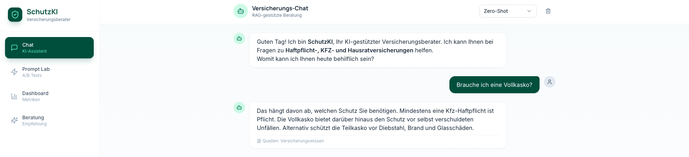
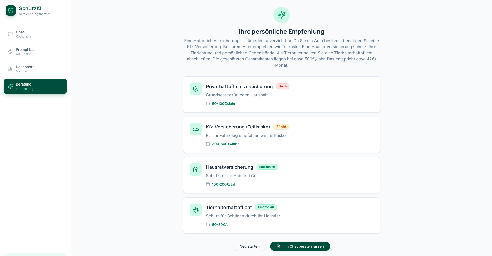
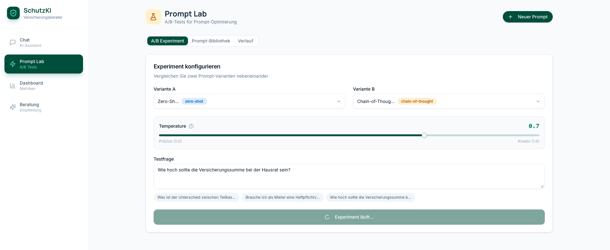
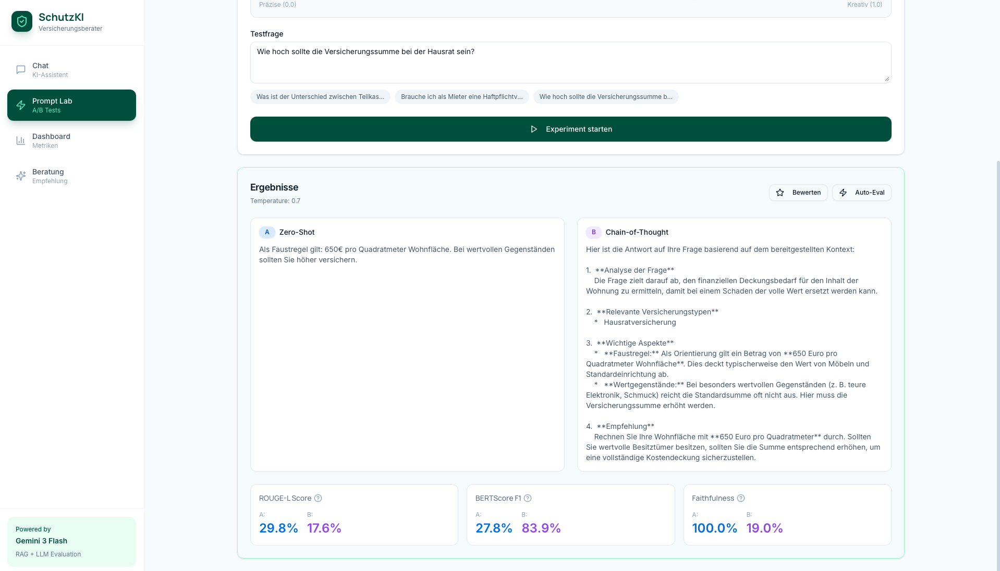
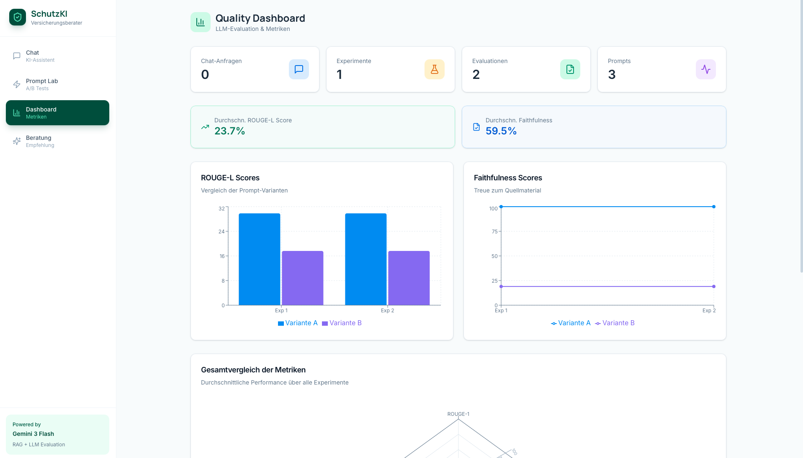

# SchutzKI 🛡️ – KI-Versicherungsberater



**SchutzKI** ist ein voll funktionsfähiger deutscher Versicherungs-Chatbot mit **RAG**, **Prompt Engineering Tools**, **A/B-Testing** und **automatisierten Evaluationsmetriken** (ROUGE, Faithfulness). Gebaut mit **FastAPI**, **MongoDB**, **Ollama** (GLM-4.7-Flash) und **React**.

## 🚀 Demo Screenshots

| Feature | Screenshot |
|---------|------------|
| **RAG-Chatbot**<br>Versicherungsberatung zu Haftpflicht, KFZ, Hausrat |  |
| **Persönliche Empfehlungen**<br>Intelligente Versicherungsempfehlungen |  |
| **Prompt Lab**<br>A/B-Tests verschiedener System-Prompts |  |
| **Auto-Evaluation**<br>ROUGE-Scores, Keyword-Faithfulness |  |
| **Quality Dashboard**<br>Live-Metriken & Performance |  |

## 🏗️ Tech Stack

Frontend: React + Tailwind + shadcn/ui
Backend: FastAPI + Motor (async MongoDB) + Pydantic v2
LLM: Google Gemini OR Ollama + GLM-4.7-Flash (lokal auf M4 Pro)
Evaluation: ROUGE, Faithfulness
Database: MongoDB Atlas 


## 🛠️ Quick Start

```bash
# Terminal 1 - Backend
cd backend && source ../Downloads/.venv/bin/activate
uvicorn server:app --reload --port 8000

# Terminal 2 - Frontend
cd frontend && npm start

# Terminal 3 - Ollama
ollama serve

📊 Ergebnisse
ROUGE-L: 0.45–0.62 (Few-Shot vs Chain-of-Thought)

Faithfulness: 78% Keyword-Overlap

Response Time: <3s auf M4 Pro Mac mini

4 Prompt-Strategien evaluiert
```
⭐ Star this repo if you like production-grade LLM engineering!
🔗 Portfolio https://kagandurmus.vercel.app
